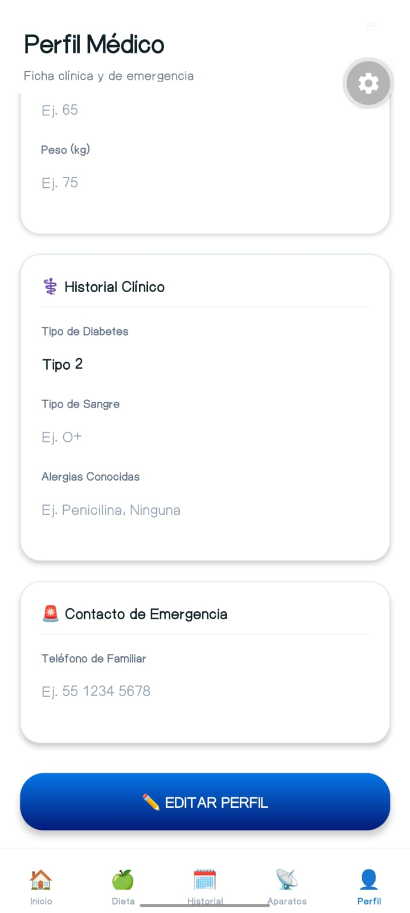
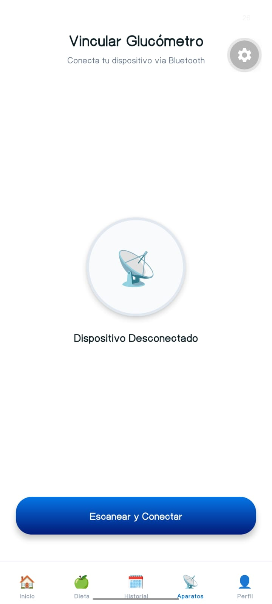
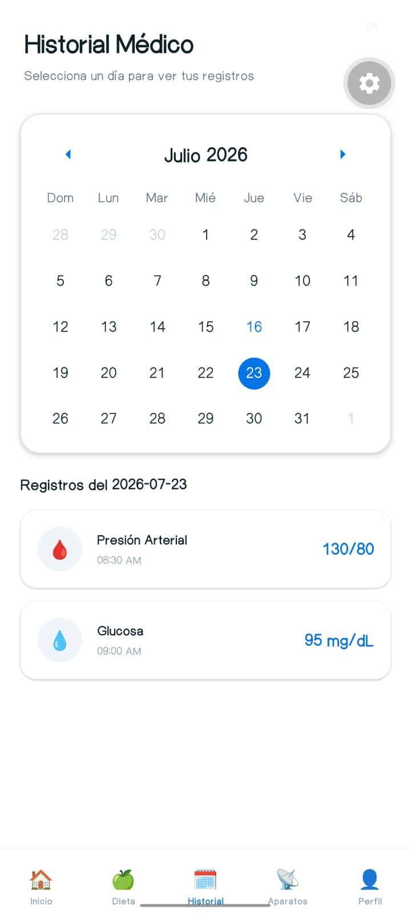
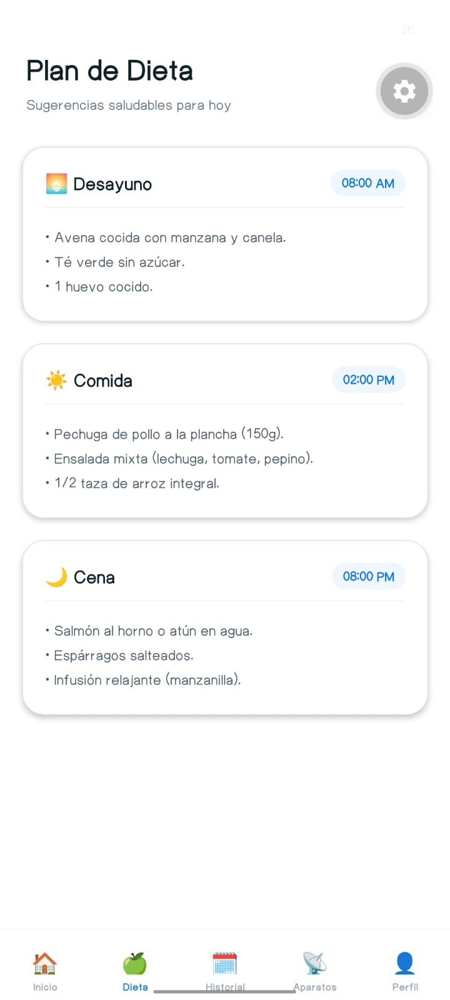
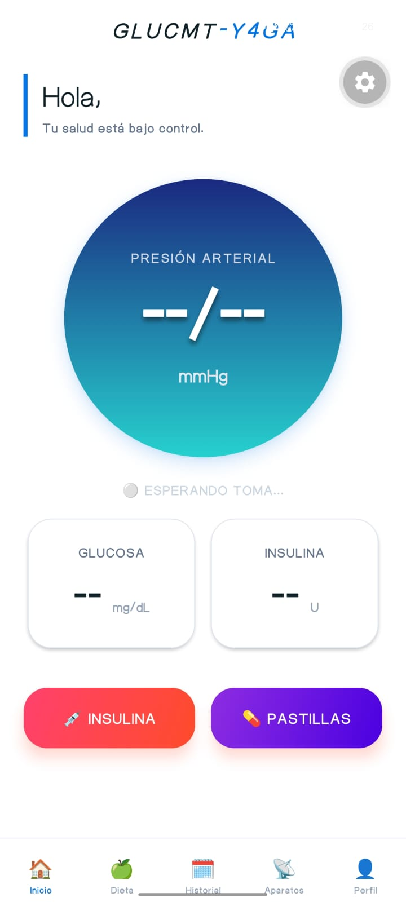

# GLUCMT-Y4GA 🩸

**Aplicación móvil de grado clínico para el monitoreo y gestión de la salud (Glucosa, Presión Arterial, Dieta y Medicamentos)**.

GLUCMT-Y4GA es un proyecto desarrollado con React Native (Expo) que integra un diseño minimalista de alto contraste (Light Mode) enfocado en la usabilidad médica, y cuenta con integración Bluetooth Low Energy (BLE) para capturar lecturas de dispositivos físicos como glucómetros y baumanómetros (OMRON).

---

## ✨ Características Principales

* **🏥 Interfaz Minimalista Clínica**: Diseño UI/UX en Light Mode, pensado para la máxima legibilidad de pacientes, con tipografía robusta y tarjetas limpias.
* **📡 Sincronización Bluetooth (BLE)**: Conexión con dispositivos médicos en tiempo real para extraer presión arterial y glucosa.
* **📊 Dashboard en Tiempo Real**: Visualización inmediata del último estado de salud, con un indicador visual pulsante.
* **🗓️ Historial Médico**: Calendario interactivo con registros diarios de signos vitales.
* **🍏 Plan de Dieta Dinámico**: Sistema CRUD (Crear, Leer, Eliminar) para planificar horarios y comidas.
* **💊 Gestión de Medicamentos**: Control de tomas y dosis.
* **💉 Registro de Insulina**: Módulo de acceso rápido para registrar unidades de insulina inyectadas.
* **👤 Perfil Médico Integral**: Almacenamiento de datos clínicos de emergencia (alergias, tipo de sangre, contactos).

---

## 📸 Capturas de Pantalla

A continuación, se muestra el diseño de la aplicación:

<div align="center">
  
  &nbsp;
  
  &nbsp;
  
  &nbsp;
  
  &nbsp;
  
</div>

---

## 🛠️ Tecnologías Utilizadas

* **Framework**: React Native (Expo)
* **Estado Global**: Zustand
* **Navegación**: React Navigation (Bottom Tabs & Native Stack)
* **Calendario**: react-native-calendars
* **Bluetooth**: react-native-ble-plx
* **UI**: expo-linear-gradient, StyleSheet Nativo

---

## 📁 Estructura del Proyecto

El repositorio está organizado siguiendo las mejores prácticas para aplicaciones escalables en React Native:

```text
GLUCMT_Y4GA/
├── App.js                     # Punto de entrada ultra limpio
├── README.md
├── assets/
│   └── screenshots/           # Capturas de la interfaz
└── src/
    ├── navigation/            # Lógica de enrutamiento
    │   └── AppNavigator.js    # Stack y Tabs principales
    ├── screens/               # Vistas visuales UI
    │   ├── BluetoothScreen.js
    │   ├── DashboardScreen.js
    │   ├── DietScreen.js
    │   ├── HistoryScreen.js
    │   ├── InsulinLogScreen.js
    │   ├── MedicationScreen.js
    │   └── ProfileScreen.js
    ├── services/              # Lógica de negocio e integraciones
    │   ├── bleManager.js      # Conexión Bluetooth
    │   ├── firebaseConfig.js  # Credenciales BD
    │   └── notifications.js   # Lógica de alarmas
    └── store/                 # Estado global de la App
        └── store.js           # Zustand (Dieta, Perfil, Medicamentos, etc.)
```

---

## 🚀 Instalación y Uso

1. **Clonar el repositorio**:
   ```bash
   git clone https://github.com/TU_USUARIO/GLUCMT_Y4GA.git
   cd GLUCMT_Y4GA
   ```

2. **Instalar dependencias**:
   ```bash
   npm install
   ```

3. **Ejecutar en entorno de desarrollo**:
   ```bash
   npx expo start
   ```
   > Para pruebas en dispositivos físicos Android con Bluetooth, utiliza una *Development Build* y depuración USB: `npx expo run:android`

---

## 📌 Próximos Pasos (Roadmap)
- [ ] Implementación de Firebase (Firestore) para la sincronización en la nube.
- [ ] Integración de notificaciones push (`expo-notifications`) para alarmas de medicación.
- [ ] Gráficas de tendencias semanales de glucosa.
